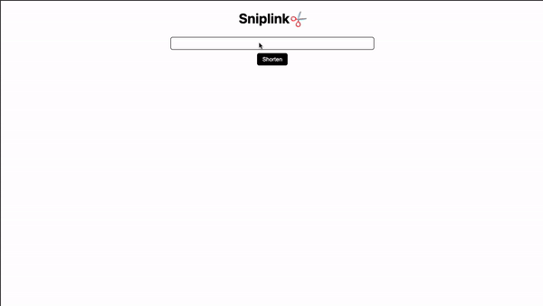

# SNIPLINK

Simple link shortener, was created for practicing with the airtable api and for test the new middleware feature of NextJs 12.

[sniplink.tk](https://sniplink.tk)


## Setting up

First of all you have to create you airtable with the next formats and names:

**Table Name**: links-shortener
**production sheet**: links
**development sheet**: links-dev

|Field Name|Type|
|---|---|
|uid|Single line text|
|link|Single line text|

Besides that, you have to [generate your api-key](https://support.airtable.com/hc/en-us/articles/219046777-How-do-I-get-my-API-key-) and to get your airtable id and put them into the [.env.local](.env.local) file

### Installing and running

```bash
npm install &&
npm run dev
```

## Stack

Vercel
NextJS
ReactJS
Type Script
React Query
